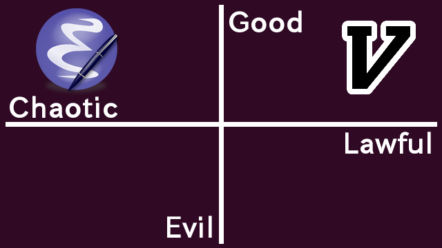

# Text Editing in Ruby

大江戸Ruby会議06  2017/3/20


前田 修吾
株式会社ネットワーク応用通信研究所

## 今日のテーマ

* Rubyによるテキスト編集

## アンケート

主に使っているエディタは？

1. Emacs系
2. vi系
3. それ以外

## 不満

* Emacs Lisp
* Vim script
* **Ruby**を使いたい

## Past work

* ruby-jed
* if_ruby for Vim

## JED

* The JED Programmer's Editor
* S-Lang
    * curses的なライブラリに独自言語の抱き合わせ
* Emacsエミュレーション

## ruby-jed

```ruby
def ruby_shell
  if buf = Buffer.find($ruby_shell_buffer)
    end_of_buffer
  else
    buf = Buffer.new($ruby_shell_buffer)
  end
  buf.show
  set_mode($ruby_shell_mode_name, LANGUAGE_MODE)
  use_keymap($ruby_shell_mode_name)
  use_syntax_table($ruby_mode_name)
  run_hooks(:ruby_shell_mode_hook)
  insert $curbuf.ruby_prompt
end
```

## Vim

* Vi IMproved
* Tcl/Perl/Pythonなどのインタフェイス

## if_ruby

```ruby
print "Hello"
VIM.command(cmd)
num = VIM::Window.count
w = VIM::Window[n]
cw = VIM::Window.current
num = VIM::Buffer.count
b = VIM::Buffer[n]
cb = VIM::Buffer.current
w.height = lines
w.cursor = [row, col]
pos = w.cursor
name = b.name
line = b[n]
num = b.count
b[n] = str
b.delete(n)
b.append(n, str)
line = VIM::Buffer.current.line
num = VIM::Buffer.current.line_number
VIM::Buffer.current.line = "test"
```

## これで解決？

* 結局あまり使わなかった
* 主言語とのインピーダンス・ミスマッチ
    * パラダイム・データ型などの違い
* 拡張性の低さ
    * 拡張を想定している部分しか拡張できない

## Rubyでエディタを作ろう

* Textbringer
    * https://github.com/shugo/textbringer

## Stormbringer


## エルリックサーガ

* マイクルムアコックが書いたファンタジー小説群
* 主人公 エルリック
    * メルニボネの皇帝 (ルビーの玉座)
    * 白子 (白髪、白い肌、赤い目) にして病弱
    * 混沌の神アリオッホ (アリオッチ) に仕える
* ストームブリンガー
    * 黒の剣
    * 魂を啜ってエルリックにその力を与える

## 法と混沌、そして天秤

* 法 (Law)
    * 秩序・規律 → 停滞
* 混沌 (Chaos)
    * 多様性・変化 → 破壊
* 宇宙の天秤 (Cosmic Balance)
    * 法と混沌の釣り合い

## Cosmic Balance



## 開発方針

* ユーザインタフェイス
* バッファの内部表現
* 拡張性

## ユーザインタフェイス

* Text User Interface
    * curses
    * Windows、Macでも動く (たぶん)
* Emacs風
    * キーバインディング
    * コマンド体系

## なぜEmacs風なのか

* 拡張性
    * MUAを実装してEmacsを捨てたい
    * 混沌を倒すには混沌の力が必要
* Cosmic Balance
    * Vimへの転向者が多い

## Emacsとの違い

* redoがundoと別コマンド
* ctags使用
    * ripper-tagsを拡張したtbtagsコマンドを用意
* M-*/M-?でglobal-mark-ringを前後に移動
* 一行ずつスクロール
    * (setq scroll-conservatively 1)相当
    
## バッファの内部表現

* 一つのStringオブジェクト
* バッファギャップ方式
    * 例: "hello world"の"r"の直前が挿入位置の場合

          0 1 2 3 4 5 6 7 8           9 10
          ---------------------------------
          |h|e|l|l|o| |w|o| | | | | |r|l|d|
          ---------------------------------

## 文字コード

* US-ASCII
    * 日本語が使えなくてつらい
* UTF-32LE/BE
    * 文字列リテラルが使えなくてつらい
* UTF-8
    * 採用

## UTF-8の利点

* 表現できる文字が多い
* 任意の位置から前後に進める
* 拡張コードを書きやすい
    * default source encoding

## UTF-8の欠点

* 1文字の長さが可変
    * 正確には、符号化された時のバイト列の長さが
      コードポイントによって異なる
* 文字(コードポイント)単位のインデックスアクセスがO(n)

## 対策

* UTF-8のバイト列をASCII-8BITで保持
* バッファ上の位置はバイト単位で扱う
* 必要に応じてUTF-8にforce_encoding

## つらい

```ruby
def byteindex(forward, re, pos)
  @match_offsets = []
  method = forward ? :index : :rindex
  adjust_gap(0, point_max)
  if @binary
    offset = pos
  else
    offset = @contents[0...pos].force_encoding(Encoding::UTF_8).size
    @contents.force_encoding(Encoding::UTF_8)
  end
  begin
    i = @contents.send(method, re, offset)
    if i
      m = Regexp.last_match
      if m.nil?
        # A bug of rindex
        @match_offsets.push([pos, pos])
        pos
      else
        b = m.pre_match.bytesize
        e = b + m.to_s.bytesize
        if e <= bytesize
          @match_offsets.push([b, e])
          match_beg = m.begin(0)
          match_str = m.to_s
          (1 .. m.size - 1).each do |j|
            cb, ce = m.offset(j)
            if cb.nil?
              @match_offsets.push([nil, nil])
            else
              bb = b + match_str[0, cb - match_beg].bytesize
              be = b + match_str[0, ce - match_beg].bytesize
              @match_offsets.push([bb, be])
            end
          end
          b
        else
          nil
        end
      end
    else
      nil
    end
  ensure
    @contents.force_encoding(Encoding::ASCII_8BIT)
  end
end
```

## Feature #13110

```ruby
s = "あああいいいあああ"
p s.byteindex(/ああ/, 4) #=> 18
x, y = Regexp.last_match.byteoffset(0) #=> [18, 24]
s.bytesplice(x...y, "おおお")
p s #=> "あああいいいおおおあ"
```

## 拡張性

* Pure Ruby
    * Rubyの動的特徴を活かす
* やろうと思えば表示コードも拡張できる

## プラグイン

* Gemとして実装
    * `gem install textbringer-presentation`
* lib/textbringer_plugin.rbがロードされる

## コマンド定義

```ruby
define_command(:fizzbuzz,
               doc: "Do FizzBuzz from 1 to n.") do
 |n = number_prefix_arg|
  (1..n).each do |i|
    insert ["Fizz"][i%3]
    insert ["Buzz"][i%5]
    insert i if beginning_of_line?
    newline
  end
end
fizzbuzz(15) # メソッドとして呼べる
```

## キーマップ定義

```ruby
GLOBAL_MAP.define_key("\C-x\C-f", :find_file)
GLOBAL_MAP.define_key("\C-xb", :switch_to_buffer)
GLOBAL_MAP.define_key("\C-x\C-s", :save_buffer)
GLOBAL_MAP.define_key("\C-x\C-w", :write_file)
GLOBAL_MAP.define_key("\C-xk", :kill_buffer)
```

## モード定義

```ruby
class ProgrammingMode < FundamentalMode
  define_generic_command :indent_line

  PROGRAMMING_MODE_MAP = Keymap.new
  PROGRAMMING_MODE_MAP.define_key("\t", :indent_line_command)

  def initialize(buffer)
    super(buffer)
    buffer.keymap = PROGRAMMING_MODE_MAP
  end
```

## 今後の構想

* バックグラウンド処理
    * command loopでコールバック処理
* MUA

## END
